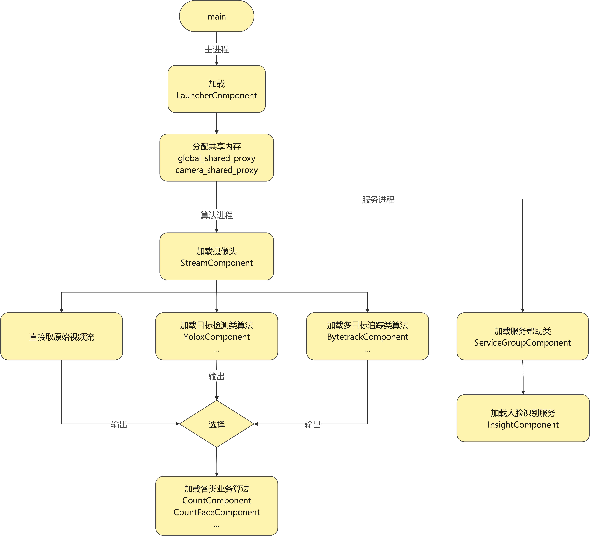
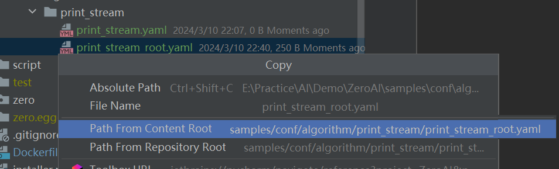
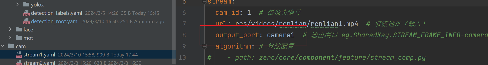
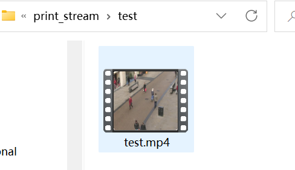

# ZeroAI（持续更新中）

ZeroAI是一个由**配置文件驱动**的**组件式**，基于**视频流**的**多进程**AI框架，支持任意数量AI算法的快速部署与整合。

* 高效：

  * 基于Python多进程编写，相比于Socket通信，效率更高
  * 基于GPU的推理，可采用Tensor RT或ONNX-GPU加速

* 灵活性强：

  * 基于配置文件驱动，通过修改配置文件，可以实现算法的自由切换与高度自定义配置

  * 基于Port的设计，使得每阶段的输出结果可以复用

* 可扩展性强：

  * 基于组件式的设计，无需改动框架结构，可以轻松实现逻辑的横向、纵向扩展

* 易上手：

  * 框架预提供了丰富的组件，可以很轻松地根据需要接入自己的业务
  * 配备贴心的教程文档，助力开发人员快速上手

# 文档目录

- [ZeroAI（持续更新中）](#zeroai持续更新中)
- [文档目录](#文档目录)
  - [一、工程目录结构](#一工程目录结构)
  - [二、安装](#二安装)
    - [1.虚拟环境安装](#1虚拟环境安装)
    - [2.Docker 安装](#2docker-安装)
  - [三、效果演示](#三效果演示)
    - [1.计数的同时人脸识别](#1计数的同时人脸识别)
    - [2.单目标检测算法跑多个视频流](#2单目标检测算法跑多个视频流)
  - [四、关键概念](#四关键概念)
    - [1.框架图示](#1框架图示)
    - [2.Component 分类](#2component-分类)
    - [3.Component 生命周期函数](#3component-生命周期函数)
    - [4.Info 配置信息](#4info-配置信息)
    - [5.Config 配置](#5config-配置)
    - [6.Port 端口](#6port-端口)
    - [7.共享内存（可选）](#7共享内存可选)
    - [8.共享内存Key（可选）](#8共享内存key可选)
      - [SharedKey参考](#sharedkey参考)
      - [FaceKey参考](#facekey参考)
  - [五、自定义组件](#五自定义组件)
    - [教程1：自定义算法组件](#教程1自定义算法组件)
      - [1.编写配置文件](#1编写配置文件)
      - [2.编写Info](#2编写info)
      - [3.编写Component](#3编写component)
      - [4.接入框架](#4接入框架)
      - [5.运行](#5运行)
      - [6.最终效果](#6最终效果)
    - [进阶：框架源码参考](#进阶框架源码参考)
  - [TODO](#todo)


## 一、工程目录结构

```
.
├── bin                    # main脚本，运行时内容
├── conf                   # 各种配置
│   ├── algorithm              # 算法配置
│   ├── cam                    # 视频流配置（一个视频流配置可对应多个算法）
│   ├── global                 # 全局配置
│   ├── application-dev.yaml   # 项目根配置（开发环境）
│   └── application-pro.yaml   # 项目根配置（生产环境）
├── lib                    # 各类算法
│   ├── business               # 业务类算法
│   ├── detection              # 目标检测算法
│   ├── face                   # 人脸识别算法
│   ├── mot                    # 多目标追踪算法
│   └── reid                   # 重识别算法
├── log                    # 日志（自动生成）
├── output                 # 框架输出
├── pretrained             # 预训练权重
├── res                    # 资源
│   ├── images                 # 图像资源
│   └── videos                 # 视频资源
├── script                 # 脚本工具
├── zero                   # ZeroAI框架
│   ├── core                   # 框架核心代码
│   └── utility                # 框架工具脚本
├── README.md              # 说明文档
├── setup.py               # 自定义包安装脚本
└── requirements.txt       # 项目依赖文件
```

## 二、安装

所有测试资源和权重私聊本人获取，不公开

### 1.虚拟环境安装


```sh
# 创建虚拟环境并激活
conda create -n zeroai python=3.9 -y
conda activate zeroai

# 安装pytorch CUDA11.3
conda install pytorch==1.12.1 torchvision==0.13.1 torchaudio==0.12.1 cudatoolkit=11.3 -c pytorch

# 安装requirement.txt和自定义包
git clone htcondatps://github.com/congtoudada/ZeroAI.git
cd ZeroAI
pip install -r requirements.txt
python installer.py
```

> Tips：
>
> * conda镜像源参考：https://blog.csdn.net/weixin_43702653/article/details/125351698
> * pip镜像源参考：https://blog.csdn.net/chengyikang20/article/details/127455339

### 2.Docker 安装

> Tips：时间有限，目前只测试了Windows上Docker的安装运行，Linux基本适用，可能在图形显示上略有差异

【可选】安装VcXsrv：使得容器能够在Windows上显示图形，否则不要勾选算法可视化（默认关闭，不影响）

* 教程：https://www.bilibili.com/read/cv15359444/?from=search（仅看`→配置VcXsrv`）

```sh
# 进入项目目录
cd ZeroAI/
# 构建镜像
docker build -t zeroai:latest .

# 创建文件夹
mkdir pretrained
mkdir res

# 运行容器(Windows)
docker run --name zero-ai --gpus all -it --rm `
-v ${PWD}\conf:/workspace/ZeroAI/conf `
-v ${PWD}\pretrained:/workspace/ZeroAI/pretrained `
-v ${PWD}\res:/workspace/ZeroAI/res `
-v ${PWD}\log:/workspace/ZeroAI/log `
-v ${PWD}\output:/workspace/ZeroAI/output `
-e DISPLAY=host.docker.internal:0 --device /dev/video0:/dev/video0:mwr `
--net=host --privileged zeroai:latest

# 启动sample算法(容器内运行)
python3 bin/main.py
```

> Tips：
>
> ```sh
> # 运行容器(Linux)
> docker run --name zero-ai --gpus all -it --rm \
> -v $PWD/conf:/workspace/ZeroAI/conf \
> -v $PWD/pretrained:/workspace/ZeroAI/pretrained \
> -v $PWD/res:/workspace/ZeroAI/res \
> -v $PWD/log:/workspace/ZeroAI/log \
> -v $PWD/output:/workspace/ZeroAI/output \
> -e DISPLAY=host.docker.internal:0 --device /dev/video0:/dev/video0:mwr \
> --net=host --privileged zeroai:latest
> ```

## 三、效果演示

>Tips：非最终效果，后期有新测试数据会替换

### 1.计数的同时人脸识别

安装环境后，运行`bin/main.py`即可


解释：

* video_fps：视频帧率，实际使用时是读一帧丢一帧。正常视频流是24-30fps，因此该数值只要满足12-15fps即可

* inference_fps：是自定义范围测试的fps，上图仅限计数组件本身耗时，不包括目标检测和目标追踪

* 灰线：人脸识别范围线，进入该区域将进行人脸识别，识别成陌生人的对象会继续识别直到消失

* 红蓝线：计数参考线，当人从红线上方穿过蓝线下方时会进行计数

* 人头包围框之上的两个数字：

  * 左：对象id

  * 右：人脸id（1表示陌生人）

<hr>

具体做法

> 1.替换配置文件内容

位置：`conf/cam/stream1.yaml`

开启目标检测，多目标追踪，计数+人脸识别算法

```yaml
stream:
  algorithm: # 算法配置
    - path: lib/detection/yolox_module/yolox/zero/component/yolox_comp.py
      conf: conf/algorithm/detection/yolox/yolox_head.yaml  # 此处替换为检测人头的权重
    - path: lib/mot/bytetrack_module/bytetrack/zero/component/bytetrack_comp.py
      conf: conf/algorithm/mot/bytetrack/bytetrack_head.yaml
    - path: lib/business/count/extension/count_face_comp.py
      conf: conf/algorithm/business/count/count_face/count_face.yaml
```

位置：`conf/algorithm/business/count/count_root.yaml`

开启人脸计数算法的可视化

```yaml
stream:
  draw_vis:
    enable: True  # 是否可视化
```

> Tips：记得关闭`conf/algorithm/detection/detection_root.yaml`的可视化，否则会显示两个窗口哦

> 2.运行：`python bin/main.py`

### 2.单目标检测算法跑多个视频流

> 1.替换配置文件内容

位置：`conf/application-dev.yaml`

确保获取两个视频流，在这两个文件内可以设置取流地址

```yaml
cam_list:
  - conf/cam/stream1.yaml
  - conf/cam/stream2.yaml
```

位置：`conf/cam/stream1.yaml`

设置流配置文件内的yolox的配置文件

```yaml
algorithm:     
 - path: lib/detection/yolox_module/yolox/zero/component/yolox_comp.py  # 使用yolox目标检测
   conf: conf/algorithm/detection/yolox/yolox_person.yaml  # yolox配置文件
```

位置：`conf/algorithm/detection/detection_root.yaml`

确保检测组件的可视化功能是开启的

```yaml
stream:
  draw_vis:
    enable: True  # 是否可视化
```

<hr>
> 2.运行：`python bin/main.py`


## 四、关键概念

### 1.框架图示

框架流程纵向流程图



框架流程横向示意图


> Tips：
>
> * 每个Component通常对应一个Info，用于存储配置参数。
> * **Based**xxx，通常说明组件的**输入**来自哪里；**Base**xxx，通常说明组件**输出**到哪里。

### 2.Component 分类

|          | 基础组件                                                     | 算法组件                         | 服务组件                               | 帮助组件                                                    |
| -------- | ------------------------------------------------------------ | -------------------------------- | -------------------------------------- | ----------------------------------------------------------- |
| 职责     | 管理其他组件                                                 | 执行算法                         | 提供全局服务                           | 拓展或完善算法或服务组件功能                                |
| 运行进程 | 独立进程                                                     | 独立进程                         | 独立进程                               | 依赖其他进程                                                |
| 实时性   | 实时                                                         | 实时                             | 非实时                                 | 取决于绑定组件                                              |
| 举例     | Launcher：启动组件，负责管理整个框架的初始化与运作<br />Stream：流组件，负责取流并初始化各个算法 | Yolox：目标检测<br />Count：计数 | Insight：人脸识别                      | FaceHelper：辅助人脸识别通信<br />SaveVideoHelper：存储视频 |
| 输入     | 无                                                           | 流组件或算法组件本身             | 算法组件的请求（通常由帮助组件做转发） | 取决于绑定的组件                                            |
| 输出     | Launcher无输出，Steram输出视频流                             | 根据需求决定                     | 响应算法组件（通常由帮助组件做转发）   | 取决于绑定的组件                                            |
| 公共父类 | Component                                                    | BasedStreamComponent             | BaseServiceComponent                   | BaseHelperComponent                                         |

> Tips：流组件本身既是基础组件也是算法组件，可以从`application.yaml`的`cam_list`项配置，也可以从`stream.yaml`的`algorithm`项配置，效果一样。这里为了一致性，把流组件归类为基础组件。

### 3.Component 生命周期函数

* `__init__`：构造函数。主要用于声明变量或进行简单初始化。
* `on_start`：初始化时调用一次。主要用于复杂的初始化工作。
* `on_update`：每帧调用，具体频率由配置文件指定。主要用于运行算法逻辑，返回bool。通常只有父类返回True，才会执行子类更新逻辑。
* `on_destroy`：销毁时调用。释放资源。
* `on_analysis`：每帧调用，具体频率由配置文件指定。自动打印日志。

```python
class Component(ABC):
    def __init__(self, shared_data: dict):
        self.pname = "component"
        self.enable = True
        self.shared_data: dict = shared_data
        self.config: BaseInfo = None
        self.pname = f"[ {os.getpid()}:component ]"
        self.esc_event = None

    def on_start(self):
        if self.shared_data is not None:
            self.esc_event = self.shared_data[SharedKey.EVENT_ESC]
        if LogKit.load_info(self.config):  # 新进程设置日志
            pass
            # logger.info(f"{self.pname} 成功运行日志模块! 输出路径: {self.config.log_output_path}")
        else:
            logger.info(f"{self.pname} 日志模块被关闭!")

    def on_update(self) -> bool:
        return True

    def on_destroy(self):
        logger.info(f"{self.pname} destroy!")

    def on_analysis(self):
        pass

    ...
```

> Tips：
>
> * 某些组件可能有自己单独的生命周期函数
> * 帮助类组件设计得十分灵活，主要由其他组件驱动，因此可以不遵循组件生命周期

### 4.Info 配置信息

通常每一个Component都对应一个Info文件，用于存放从配置文件中读取的配置信息，共享内存的Key等。使用Info文件可以有效避免手动输入字符串导致的错拼、漏拼的问题。

```python
# BasedDetComponent对应的Info
class BasedDetInfo(BasedStreamInfo):
    def __init__(self, data: dict = None):
        self.input_port = []  # 输入端口
        self.detection_labels = []  # 类别标签
        super().__init__(data)
        # ----------------------------------------- input -----------------------------------------
        self.DETECTION_INFO = f"{SharedKey.DETECTION_INFO.name}-{self.input_port[0]}"
        self.DETECTION_TEST_SIZE = f"{SharedKey.DETECTION_TEST_SIZE.name}-{self.input_port[0]}"
```

> Tips：切记，除非你明确知道后果，如果需要加载配置文件的内容，需将`super().__init__(data)`放在变量声明的最后。

### 5.Config 配置

参考SpringBoot配置规则，编写自定义解析模块：

* 支持`INCLUDE`关键字，通过加载其他配置文件来为自身添加所需配置；
* 基于YAML文件，支持配置细粒度重载；充分利用python动态语言特性，支持通过`set_attrs`自动赋值。

工作流程：编写yaml配置文件 --> 编写对应的info脚本 --> 利用ConfigKit工具加载配置 --> 组件借助info脚本访问配置

Yolox yaml配置参考：

```yaml
INCLUDE:
  - conf/algorithm/detection/yolox/yolox_root.yaml
stream:
  input_ports:  # 输入端口 eg.SharedKey.STREAM_FRAME_INFO-camera1
    - camera1
    - camera2
detection:
  output_port: yolox  # 输出端口 eg.SharedKey.STREAM_FRAME_INFO-yolox-camera1
yolox:
  args:
    expn: head  # 实验名称
    path: null  # 取流路径（为None则通过内部框架取流）
    save_result: False # 是否存储视频
    ...
```

YoloxInfo参考：

在最后调用`super().__init__(data)`来重载配置

```python
class YoloxInfo(DetInfo):
    def __init__(self, data: dict = None):
        self.yolox_vis = False  # 是否使用opencv可视化（测试用）
        self.yolox_args_expn = ""  # 实验名称
        self.yolox_args_path = None  # 取流路径（为None则通过内部框架取流）
        self.yolox_args_save_result = False  # 是否存储视频
        ...
        super().__init__(data)  # 前面是声明，一定要最后调用这段赋值
```

YoloxComponent参考：

其中`self.config`就是根据路径从配置文件中加载的配置

```python
class YoloxComponent(BaseDetComponent):
    def __init__(self, shared_data, config_path: str):
        super().__init__(shared_data)
        self.config: YoloxInfo = YoloxInfo(ConfigKit.load(config_path))
        self.pname = f"[ {os.getpid()}:yolox for {self.config.yolox_args_expn}]"
        # 自身定义
        self.output_dir = ""  # 输出目录
        ...
```

### 6.Port 端口

端口的目的是为了能复用组件的输入和输出

例如单个目标检测模型，可以检测多个视频流并输出：

* 流组件（StreamComponent）：从`stream_url`获取视频流作为输入，并将输出的结果送至`stream_output_port`
* 基于流的组件通过`input_port`获取输入，并输出给`output_port`

下面展示配置文件中计数算法的（依赖视频流、目标检测、目标追踪）完整端口链：

1. StreamComponent：取流`stream_url: res/videos/renlian/renlian1.mp4` --> 视频流输出`stream_output_port: camera1`
2. BaseDetComponent：来自camera1的输出`input_port: [camera1]` --> 检测模型`output_port: yolox`
3. BaseMOTComponent：来自检测模型的输出`input_port: camera1-yolox` --> 追踪模型输出`output_port: camera1-bytetrack`
4. CountComponent：来自追踪模型的输出`input_port: camera1-bytetrack` --> 计数业务输出`output_port: None`

### 7.共享内存（可选）

基于`multiprocessing.Manager().dict()`（按照普通dict使用即可）实现进程间通信，进程安全

* `shared_data`：摄像头独享，用于单个视频流内算法的通信
* `global_shared_data`：全局共享内存，所有摄像头共享，利用`camera_id`可以访问到特定摄像头的`shared_data`

### 8.共享内存Key（可选）

共享内存基于`dict`，因此需要有Key，为了避免繁琐的字符串拼写，所有Key使用枚举管理

* SharedKey：存放全局Key和视频流进程所需Key
* FaceKey：存放人脸识别相关Key（避免SharedKey内的Key过多）

#### SharedKey参考

```python
class SharedKey(Enum):
    """
    单个摄像头进程内，摄像头与算法共享数据的Key常量
    """
    """
    全局
    """
    EVENT_ESC = 0  # 退出事件
    WAIT_COUNTER = 1  # 服务初始化等待计数器（取决于服务数量，初始化用）
    CAMERAS = 2  # 相机dict列表
    LOCK = 3  # 锁
    
    ...
    
    """
    多目标追踪
    """
    # ---
    MOT_INFO = 300  # 多目标追踪算法信息 (package)
    MOT_ID = 301  # 当前帧ID（每次成功读取新的FRAME都会更新ID，避免算法重复处理相同帧）
    MOT_FRAME = 302  # 读取的检测图像
    # 算法输出结果 shape: [n, 7]
    # n: n个对象
    # [0,1,2,3]: ltrb bboxes (基于视频流分辨率)
    #   [0]: x1
    #   [1]: y1
    #   [2]: x2
    #   [3]: y2
    # [4]: 置信度
    # [5]: 类别 (下标从0开始)
    # [6]: id
    MOT_OUTPUT = 303
    # ---
    ...
```

#### FaceKey参考

```python
class FaceKey(Enum):
    """
    人脸识别Key
    """
    # --- 实际请求key REQ + port ---
    REQ = 0
    REQ_CAM_ID = 1
    REQ_PID = 2  #
    REQ_OBJ_ID = 4  # 追踪对象的id
    REQ_IMAGE = 5  # 人脸图像
    # --- 实际响应key RSP + port + pid ---
    RSP = 10
    RSP_OBJ_ID = 11
    RSP_PER_ID = 12  # 人脸识别结果（1为陌生人）
    RSP_SCORE = 13  # 人脸识别分数
```

## 五、自定义组件

### 教程1：自定义算法组件

在下面的教程中，我们将参考`StreamComponent`，独立开发一款简单而有趣的组件，学习完该教程后，你将对自定义组件的编写有更进一步的认识。并且可以试着编写自己的组件，来接入自己的算法或业务，而不需要多少代价。

目标：我们将自定义一款基于流的算法组件（`PrintStreamComponent`），将在每帧打印日志，并将视频流显示出来，同时写入本地。

> Tips：
>
> * 为了避免与框架本身混淆，案例将放在`samples`文件夹内，目录结构与工程目录基本一致
> * 教程1中为了更好展示组件的工作机制，我们不会使用任何框架预定义的组件，所有继承均来自基类，因此代码量可能会较多一些，但是几乎每个函数或字段教程都配备了注释，方便阅读

#### 1.编写配置文件

位置：`samples/conf/algorithm/print_stream/`

先确定算法可能需要用到的参数，通常我们会声明一个`root.yaml`作为算法的根配置，作为该算法的公共配置。利用`INCLUDE`关键字可以得到其他配置文件的内容。当前配置文件也可以对包含的相同字段进行重定义，自身拥有最高的优先级。

编写print_stream_root.yaml

```yaml
INCLUDE:  # 引入全局配置
  - conf/global/log.yaml  # 日志配置
  - conf/global/output.yaml  # 输出配置

stream:  # 重载INCLUDE信息，赋值优先级高于INCLUDE
  output_dir: output/samples  # 输出目录
  save_video:
    enable: True  # 是否保存视频
  draw_vis:
    enable: True  # 是否可视化
print_stream:
  show_title: custom_sample  # 窗口名
  show_width: 480  # 窗口宽
  show_height: 360  # 窗口高
```

编写print_stream.yaml

```yaml
INCLUDE:
  - samples/conf/algorithm/print_stream/print_stream_root.yaml
input_port: camera1  # 获取来自camera1的输出
stream:
  output_dir: output/samples/print_stream  # 输出目录（赋值优先级最高）
print_stream:
  show_title: custom_stream_sample  # 窗口名（赋值优先级最高）
```

>Tips：
>
>* 在Copy路径时可以借助IDE实现
>
>
>
>* input_port依据：在conf/cam/stream1.yaml中，我们将`stream_output_port`设置为`camera1`，因此输入端口也要对应
>
>

#### 2.编写Info

位置：`samples/lib/business/print_stream/info/print_stream_info.py`

根据步骤1中yaml配置的内容，编写info文件。遵循规则：每级YAML声明加一个`_`

* 举例

* 在yaml中

  * ```yaml
    a:
     b:
      c: 10
    ```

* 在info中

  * ```python
    self.a_b_c = 0  # 这是声明
    ```

```python
from zero.core.info.base.base_info import BaseInfo
from zero.core.key.shared_key import SharedKey


class PrintStreamInfo(BaseInfo):  # 通过继承相应配置文件父类，可以减少字段的编写
    def __init__(self, data: dict = None):
        # 默认值声明通常与配置文件一致，这里为了演示配置重载，设置为系统默认值
        self.input_port = None  # 输入端口
        self.print_stream_show_title = ""
        self.print_stream_show_width = 0
        self.print_stream_show_height = 0
        super().__init__(data)  # super调用要放在声明之后，本质是由super调用重载方法
        # 调用super之后，所有值均为配置文件值
        # 组件的输入需要依赖视频流，视频流需要从共享内存中获取，这里可以声明SharedKey，方便访问共享内存
        # 这里参考 zero/core/info/based/based_stream_info.py 可以对相应SharedKey进行声明
        # 注意：这里只取一个流，而不是像BasedStreamInfo一样取多个流
        camera = self.input_port  # camera就是输入端口，也是视频流的输出端口
        self.STREAM_FRAME_INFO = f"{SharedKey.STREAM_FRAME_INFO.name}-{camera}"
        # STREAM_FRAME_INFO是视频流组件输出的一个包，每帧获取。
        # 从SharedKey源码可以看到包内含有帧序号和帧图像两个信息
        # ---
        # STREAM_FRAME_INFO = 103  # 视频流信息 (package)
        # STREAM_FRAME_ID = 104  # 原始图像ID（每次成功读取新的FRAME都会更新ID，避免算法重复处理相同帧）
        # STREAM_FRAME = 105  # 原始图像
        # ---
        # 同时，视频流进程还携带有一些摄像头配置（篇幅有限，具体可以参考zero/core/key/shared_key.py）
        self.STREAM_ORIGINAL_WIDTH = f"{SharedKey.STREAM_ORIGINAL_WIDTH.name}-{camera}"
        self.STREAM_ORIGINAL_HEIGHT = f"{SharedKey.STREAM_ORIGINAL_HEIGHT.name}-{camera}"
        self.STREAM_ORIGINAL_CHANNEL = f"{SharedKey.STREAM_ORIGINAL_CHANNEL.name}-{camera}"
        self.STREAM_ORIGINAL_FPS = f"{SharedKey.STREAM_ORIGINAL_FPS.name}-{camera}"
        self.STREAM_URL = f"{SharedKey.STREAM_URL.name}-{camera}"
        self.STREAM_CAMERA_ID = f"{SharedKey.STREAM_CAMERA_ID.name}-{camera}"
        self.STREAM_UPDATE_FPS = f"{SharedKey.STREAM_UPDATE_FPS.name}-{camera}"

```

> Tips：
>
> * 通常我们将针对特定业务解决问题的算法组件放在业务模块（algorithm/business）内，而像目标检测、多目标追踪等通用算法直接放在（algorithm/xxx）内，根据配置文件可以随时更换。
> * Info文件是可选的，本质是将yaml配置解析成dict，然后通过`set_attrs`赋值。你可以直接使用加载出来的字典或只声明部分字段，不写或漏写是允许的，但是为了避免字符串拼写，推荐常用的字段手动声明一下。

#### 3.编写Component

位置：`samples/lib/business/print_stream/component/print_stream_comp.py`

```python
import os
import time

import cv2
import numpy as np
from loguru import logger

from samples.lib.business.print_stream.info.print_stream_info import PrintStreamInfo
from zero.core.component.base.component import Component
from zero.core.component.helper.feature.save_video_helper_comp import SaveVideoHelperComponent
from zero.core.key.shared_key import SharedKey
from zero.utility.config_kit import ConfigKit
from zero.utility.timer_kit import TimerKit


class PrintStreamComponent(Component):
    def __init__(self, shared_data, config_path: str):
        super().__init__(shared_data)
        self.config: PrintStreamInfo = PrintStreamInfo(ConfigKit.load(config_path))  # 配置文件
        self.pname = f"[ {os.getpid()}:print_stream for {self.config.input_port}]"  # 组件标识，用于log
        self.frame = None
        self.update_timer = TimerKit()  # 计算帧率
        self._tic = False  # 计算帧率用
        self.current_frame_id = 0  # 当前帧id
        self.frame = None  # 当前帧图像
        self.video_writer: SaveVideoHelperComponent = None  # 存视频帮助类
        # ---- 从流组件获取的参数 ---
        self.stream_width = 0
        self.stream_height = 0
        self.stream_channel = 0
        self.stream_fps = 0
        self.stream_url = ""
        self.stream_cam_id = 0
        self.update_fps = 0

    def on_start(self):
        """
        初始化时调用一次
        :return:
        """
        super().on_start()
        # 获取摄像头视频流的信息
        self.stream_width = self.shared_data[self.config.STREAM_ORIGINAL_WIDTH]
        self.stream_height = self.shared_data[self.config.STREAM_ORIGINAL_HEIGHT]
        self.stream_channel = self.shared_data[self.config.STREAM_ORIGINAL_CHANNEL]
        self.stream_fps = self.shared_data[self.config.STREAM_ORIGINAL_FPS]
        self.stream_url = self.shared_data[self.config.STREAM_URL]
        self.stream_cam_id = self.shared_data[self.config.STREAM_CAMERA_ID]
        self.update_fps = self.shared_data[self.config.STREAM_UPDATE_FPS]
        # 初始化视频导出帮助类
        if self.config.stream_save_video_enable:
            # 设置输出文件夹: (output_dir, 取流路径的文件名）
            # 设置输出文件：取流路径的文件名.mp4
            # folder = os.path.splitext(os.path.basename(self.shared_data[SharedKey.STREAM_URL]))[0]
            filename = os.path.basename(self.stream_url).split('.')[0]
            output_dir = os.path.join(self.config.stream_output_dir, filename)
            os.makedirs(output_dir, exist_ok=True)
            output_path = os.path.join(output_dir, f"{filename}.mp4")
            self.video_writer = SaveVideoHelperComponent(output_path,
                                                         self.config.stream_save_video_width,
                                                         self.config.stream_save_video_height,
                                                         self.config.stream_save_video_fps)
            logger.info(f"{self.pname} 输出视频路径: {output_path}")

    def on_resolve_stream(self) -> bool:
        """
        自定义生命周期函数，用于解析从流组件获取的信息
        :return: 返回解析成功or失败
        """
        # 只有不同帧才有必要计算
        frame_info = self.shared_data[self.config.STREAM_FRAME_INFO]  # 从共享缓存获取指定摄像头的输出
        # 只有当前帧序号与获取的帧序号不同时，说明有新的画面传来，才有必要处理
        if frame_info is not None and self.current_frame_id != int(frame_info[SharedKey.STREAM_FRAME_ID]):
            # 更新帧序号
            self.current_frame_id = int(frame_info[SharedKey.STREAM_FRAME_ID])
            # 这里拷贝一份流图像，避免处理过程中，流图像被替换
            self.frame = np.reshape(np.ascontiguousarray(np.copy(frame_info[SharedKey.STREAM_FRAME])),
                                    (self.stream_height, self.stream_width, self.stream_channel))
            # 打印性能分析报告
            self.analysis(frame_info[SharedKey.STREAM_FRAME_ID])
            return True
        else:
            return False

    def on_update(self) -> bool:
        """
        每帧调用，主要用于运行算法逻辑
        :return: bool。通常只有父类返回True，才会执行子类更新逻辑。
        """
        if super().on_update():
            if self.update_fps > 0:  # 控制update执行帧率
                time.sleep(1.0 / self.update_fps)
            ret = self.on_resolve_stream()  # 解析流
            if ret:
                if not self._tic:
                    self.update_timer.tic()
                else:
                    self.update_timer.toc()
                self._tic = not self._tic
                return True
        return False

    def on_draw_vis(self, frame, vis=False, window_name="window", is_copy=True):
        """
        可视化时调用，用于可视化内容
        :param frame: 传入图像
        :param vis: 是否可视化
        :param window_name: 窗口名
        :param is_copy: 是否拷贝图像
        :return:
        """
        if vis and frame is not None:
            frame = cv2.resize(frame, (self.config.print_stream_show_width, self.config.print_stream_show_height))
            cv2.imshow(window_name, frame)
            if cv2.waitKey(1) & 0xFF == ord('q'):
                self.shared_data[SharedKey.EVENT_ESC].set()  # 按q退出程序
        return frame

    def on_analysis(self):
        logger.info(f"{self.pname} video fps: {1. / max(1e-5, self.update_timer.average_time):.2f}")

    def on_destroy(self):
        """
        销毁时调用，用于释放资源
        :return:
        """
        if self.video_writer is not None:
            self.video_writer.destroy()
        super().on_destroy()

    def start(self):
        """
        start操作，控制初始化
        :return:
        """
        super().start()
        logger.info(f"{self.pname} 成功初始化！")
        # 在初始化结束通知给流进程
        self.shared_data[SharedKey.STREAM_WAIT_COUNTER] += 1

    def update(self):
        """
        update操作，控制每帧更新。对于算法组件而言就是死循环，直到收到主进程的退出事件才结束
        :return:
        """
        while True:
            if self.enable:
                self.on_update()
                # 每帧最后，需要可视化和录制视频时才需要绘图
                if self.config.stream_draw_vis_enable or self.config.stream_save_video_enable:
                    if self.frame is not None:
                        im = self.on_draw_vis(self.frame, self.config.stream_draw_vis_enable,
                                              self.config.print_stream_show_title)
                        if self.config.stream_save_video_enable:
                            self.save_video(im, self.video_writer)
            if self.esc_event.is_set():
                self.destroy()
                return

    def save_video(self, frame, vid_writer: SaveVideoHelperComponent):
        """
        保存视频
        :param frame:
        :param vid_writer:
        :return:
        """
        if frame is not None:
            vid_writer.write(frame)


def create_process(shared_data, config_path: str):
    countComp: PrintStreamComponent = PrintStreamComponent(shared_data, config_path)  # 创建组件
    countComp.start()  # 初始化
    countComp.update()  # 算法逻辑循环

```

#### 4.接入框架

①在自定义组件内编写create_process函数

```python
def create_process(shared_data, config_path: str):
    countComp: PrintStreamComponent = PrintStreamComponent(shared_data, config_path)  # 创建组件
    countComp.start()  # 初始化
    countComp.update()  # 算法逻辑循环
```

<hr>

②编写setup.py脚本，安装自定义模块

位置：`samples/lib/business/setup.py`（包所在目录）

```python
#!/usr/bin/env python
# Copyright (c) Megvii, Inc. and its affiliates. All Rights Reserved
import setuptools

setuptools.setup(
    name="print_stream",
    version="0.1.0",
    author="cong tou",
    python_requires=">=3.6",
    long_description="count algorithm",
    classifiers=["Programming Language :: Python :: 3", "Operating System :: OS Independent"],
    packages=setuptools.find_namespace_packages(),
)
```

安装命令，在setup.py所在文件夹执行

```sh
python setup.py develop
```

<hr>

③修改stream配置文件，接入自定义组件到框架

位置：`conf/cam/stream1.yaml`

新增算法，填写脚本path和配置文件path即可

```yaml
algorithm: # 算法配置
  - path: samples/lib/business/print_stream/component/print_stream_comp.py
    conf: samples/conf/algorithm/print_stream/print_stream.yaml
```

#### 5.运行

修改`conf/cam/stream1.yaml`取流地址为本地视频

```yaml
stream:
  cam_id: 1  # 摄像头编号
  url: res/videos/renlian/test.mp4  # 取流地址（输入）
```

在工程根目录（ZeroAI）运行命令

```sh
python bin/main.yaml
```

#### 6.最终效果

实时取流并打印日志信息


导出成本地视频



### 进阶：框架源码参考

框架已经预提供了一些组件实现，麻雀虽小，五脏俱全，这些组价的实现思路基本已经能应对日常开发中的各种情况

算法组件实现参考：

* 【目标检测算法组件】：`lib/detection/yolox_module`
* 【多目标追踪组件】：`lib/mot/bytetrack_module`
* 【业务组件】：`lib/business`

服务组件实现参考：

* 【人脸识别服务组件】：`lib/face/insight_module`

帮助组件实现参考：

* 【人脸识别帮助组件】：`lib/face/insight_module`

## TODO

* 找工作（游戏开发）
* 拓展算法
* 接入Web后端
* 支持Tensor RT
